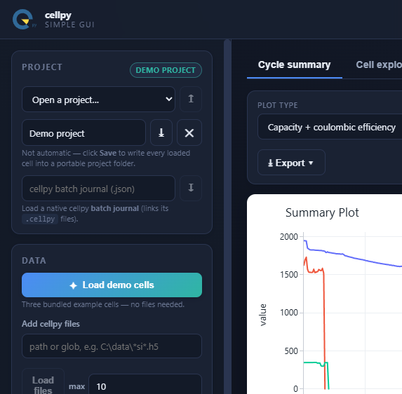

# cellpy simple gui

A small, good-looking **desktop app** for exploring battery cell data with
[**cellpy**](https://github.com/jepegit/cellpy) (**≥ 2.1**).

It runs a local [FastAPI](https://fastapi.tiangolo.com/) backend inside a native
window (via [pywebview](https://pywebview.flowrl.com/)) — so it keeps the
"runs-in-a-browser" feel of the old Streamlit demo, but is a real installable app
with a clean separation between UI, API and a reusable cellpy core.


<p align="center">
  
  
</p>

---

## Features

- **Zero-setup demo** — one click loads three bundled example cells (no files needed).
- **Load your own** `.cellpy` / legacy `.h5` files.
- **Import raw instrument files** — Arbin `.res`, Maccor (text), Neware, PEC and more are
  processed into cellpy cells with a metadata step (mass / area / nominal capacity / cycle
  mode). One-click bundled raw demos too.
- **Save & reopen projects** — the loaded set plus your grouping / labels / selection is
  written to a self-contained, portable project folder and restored later.
- **Cycle summary** across many cells — built with cellpy's own
  `collect_summaries` + plotting, with a **plot-type selector** (capacity + CE,
  capacity, coulombic efficiency, cumulated CE, end voltages, internal
  resistance, C-rate, capacity loss), a gravimetric / areal / absolute basis,
  optional group averaging with a mean ± std spread band.
- **Cell explorer** — cellpy's `collect_cycles` voltage–capacity curves for any
  set of cycles (gravimetric / areal / absolute, method), with per-cell metric tiles.
- **Load data lots of ways**: bundled demo cells, `.cellpy` / `.h5` files,
  **native cellpy batch journals** (`.json`), or your own **project folders** —
  with **glob patterns** (`*si*.h5`, capped at a configurable max) and, in the
  desktop app, **native file pickers**.
- **Editable cell list** (the "journal"): rename, group, select/deselect, remove.
- **Instruments discovered from cellpy** at runtime (not hard-coded), with each
  loader's sub-models.
- **Clear feedback**: toast notifications tell you what loaded (and why nothing did).
- **Background loading** with live progress (SSE) — the UI never freezes.
- **Export** collected data to **CSV / Excel / Parquet / JSON**; save charts as PNG
  from the chart toolbar.
- **Light & dark themes.**

## Quick start

Requires **Python ≥ 3.13** and [uv](https://docs.astral.sh/uv/).

```bash
uv sync
uv run cellpy-simple-gui
```

That opens the app in a native desktop window. Prefer your normal browser?

```bash
uv run cellpy-simple-gui --server        # runs the local server and opens a browser tab
uv run cellpy-simple-gui --server --no-open   # headless: just serve
```

Then click **Load demo cells** and explore.

> First run downloads a few small example cells from the cellpy example-data
> repository (then cached). Everything else is fully offline.


## Projects on disk

A project is a portable folder — move it, zip it, share it:

```
<project>/
├── project.json      # manifest: name, timestamps, versions, per-cell grouping/labels/selection
└── data/
    ├── c1.cellpy     # every loaded cell saved as a self-contained cellpy file
    └── c2.cellpy
```

Projects live under `~/.cellpy_simple_gui/projects/` by default; **Save** writes the
current set there and **Open** restores it (physical quantities come from the
`.cellpy` files, organisational metadata from the manifest).

## How it is built

Three layers, each testable on its own. The UI never imports cellpy; the core
never imports the web framework.

```
┌──────────────────────────────────────────────────────────────┐
│  desktop shell (pywebview window)                             │
│    └── web/  Alpine.js + Plotly.js  (served by the backend)   │
├──────────────────────────────────────────────────────────────┤
│  api/   FastAPI (127.0.0.1 + per-launch token)                │
│         routers · JobManager (threads + SSE progress)         │
├──────────────────────────────────────────────────────────────┤
│  core/  pure Python — no web imports                          │
│         models · library · plotting · export                  │
│         cellpy_adapter.py  ← the ONLY module that imports cellpy
└──────────────────────────────────────────────────────────────┘
                              │
                          cellpy ≥ 2.1
```

```
src/cellpy_simple_gui/
├── core/
│   ├── cellpy_adapter.py   # every cellpy call lives here (get, summary, get_cap, example_data)
│   ├── models.py           # Pydantic domain models (CellMeta, SummaryPlotSpec, …)
│   ├── library.py          # in-memory library of loaded cells = source of truth
│   ├── collect.py          # bridges the library into cellpy.collect / .plotting (from_cells)
│   ├── plotting.py         # thin: delegates figures to cellpy via collect.py
│   ├── projects.py         # save/open portable project folders (manifest + .cellpy files)
│   ├── files.py            # glob/path expansion with a max cap + messages
│   └── export.py           # csv / xlsx / parquet / json from cellpy collections
├── api/
│   ├── app.py              # FastAPI factory + index route
│   ├── jobs.py             # tiny thread-pool JobManager (progress + cancel)
│   └── routers/            # cells · plots · export · jobs · projects · ingest · system
├── web/                    # templates/ (Jinja) + static/ (css, js, vendored Plotly & Alpine)
├── server.py               # uvicorn-in-a-thread helper
├── desktop.py              # pywebview launcher
└── __main__.py             # entry point (desktop / --server)
```

**Powered by cellpy, not around it.** Summaries, grouping (incl. group averaging
with spread), per-cell cycle curves, the plots and the multi-format export are all
produced by cellpy's own `collect` / `plotting` subsystems. On **cellpy ≥ 2.1.1**
the app feeds them a real `Batch` via `cellpy.collect.from_cells(...)` built from
the in-memory library (`collect.py`), and discovers instruments via
`cellpy.list_instruments()`. The cellpy surface stays isolated to
`cellpy_adapter.py` + `collect.py`.

Building this surfaced a number of cellpy rough edges, filed upstream as
[jepegit/cellpy#785–#791](https://github.com/jepegit/cellpy/issues/785) — **most
were fixed in cellpy 2.1.1**, and the app has since dropped the workarounds. The
full write-up and per-item status is in
[CELLPY_PAINPOINTS.md](CELLPY_PAINPOINTS.md).

## Development

```bash
uv sync --extra dev
uv run pytest            # core unit tests + FastAPI integration tests
```

Optional static image export (server-side PNG/SVG/PDF via kaleido):

```bash
uv sync --extra export
```

## Status

This is an MVP / reference implementation — a successor design to the
`cell_processor_app` Streamlit demo.

Done: load `.cellpy`/`.h5` files, **raw-file ingestion** (Arbin `.res` / Maccor / Neware /
PEC → cellpy), cycle-summary & cell-explorer plotting, editable cell list, CSV export, and
**save/open portable projects on disk**.

> Arbin `.res` loads on Windows through the Access ODBC driver (no separate mdbtools needed
> in this environment). Instruments needing extra engines will surface a clear error.

Next step: packaging into a Windows installer (PyInstaller + InnoSetup, bundling WebView2).

## License

See [LICENSE](LICENSE).
