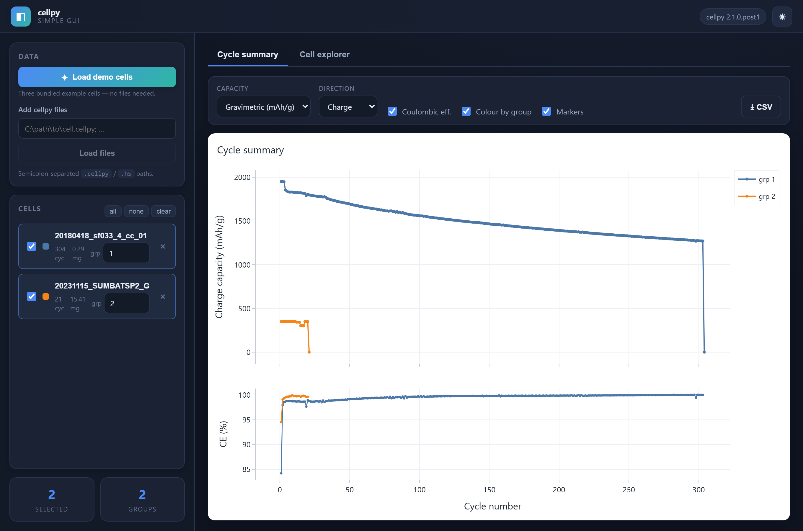
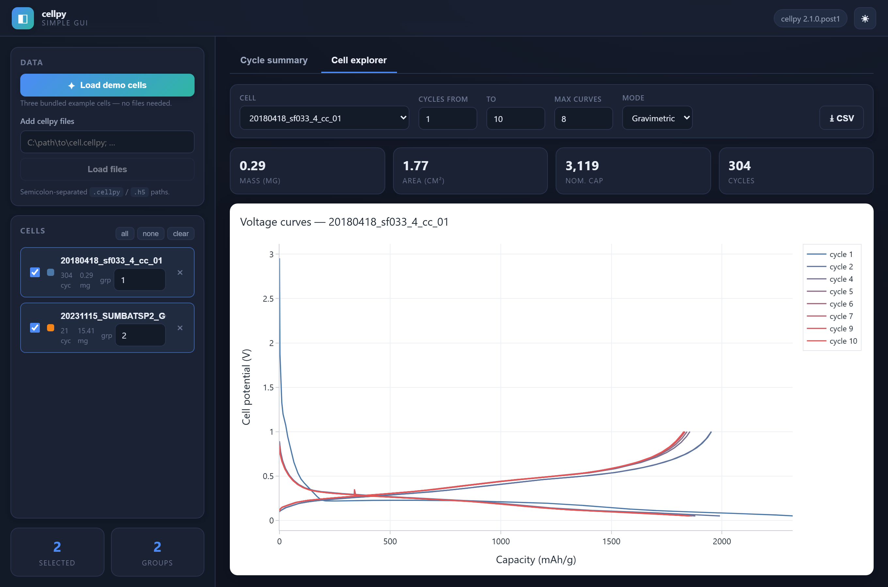
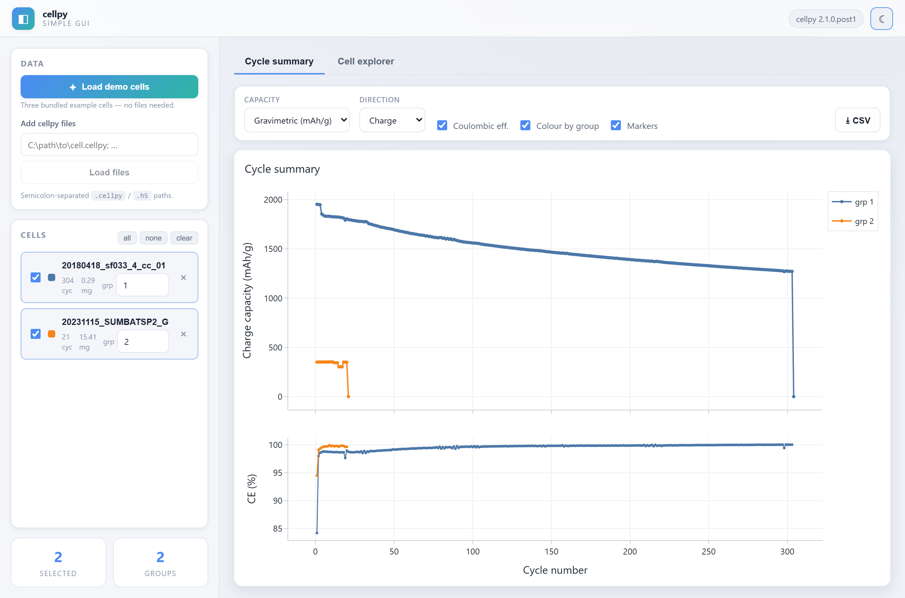

# cellpy simple gui

A small, good-looking **desktop app** for exploring battery cell data with
[**cellpy**](https://github.com/jepegit/cellpy) (**≥ 2.1**).

It runs a local [FastAPI](https://fastapi.tiangolo.com/) backend inside a native
window (via [pywebview](https://pywebview.flowrl.com/)) — so it keeps the
"runs-in-a-browser" feel of the old Streamlit demo, but is a real installable app
with a clean separation between UI, API and a reusable cellpy core.



<p align="center">
  
  
</p>

---

## Features

- **Zero-setup demo** — one click loads three bundled example cells (no files needed).
- **Load your own** `.cellpy` / legacy `.h5` files.
- **Cycle summary** across many cells: charge/discharge capacity vs. cycle
  (gravimetric / areal / absolute) with an optional coulombic-efficiency panel,
  grouping and colour-by-group.
- **Cell explorer**: voltage–capacity curves for any set of cycles, with a
  blue→red cycle progression and per-cell metric tiles.
- **Editable cell list** (the "journal"): rename, group, select/deselect, remove.
- **Background loading** with live progress (SSE) — the UI never freezes.
- **Export** summary and cycle data to CSV; save charts as PNG from the chart toolbar.
- **Light & dark themes.**

## Quick start

Requires **Python ≥ 3.13** and [uv](https://docs.astral.sh/uv/).

```bash
uv sync
uv run cellpy-simple-gui
```

That opens the app in a native desktop window. Prefer your normal browser?

```bash
uv run cellpy-simple-gui --server        # runs the local server and opens a browser tab
uv run cellpy-simple-gui --server --no-open   # headless: just serve
```

Then click **Load demo cells** and explore.

> First run downloads a few small example cells from the cellpy example-data
> repository (then cached). Everything else is fully offline.

## How it is built

Three layers, each testable on its own. The UI never imports cellpy; the core
never imports the web framework.

```
┌──────────────────────────────────────────────────────────────┐
│  desktop shell (pywebview window)                             │
│    └── web/  Alpine.js + Plotly.js  (served by the backend)   │
├──────────────────────────────────────────────────────────────┤
│  api/   FastAPI (127.0.0.1 + per-launch token)                │
│         routers · JobManager (threads + SSE progress)         │
├──────────────────────────────────────────────────────────────┤
│  core/  pure Python — no web imports                          │
│         models · library · plotting · export                  │
│         cellpy_adapter.py  ← the ONLY module that imports cellpy
└──────────────────────────────────────────────────────────────┘
                              │
                          cellpy ≥ 2.1
```

```
src/cellpy_simple_gui/
├── core/
│   ├── cellpy_adapter.py   # every cellpy call lives here (get, summary, get_cap, example_data)
│   ├── models.py           # Pydantic domain models (CellMeta, SummaryPlotSpec, …)
│   ├── library.py          # in-memory library of loaded cells = source of truth
│   ├── plotting.py         # builds Plotly figure JSON from cell data
│   └── export.py           # CSV / image export
├── api/
│   ├── app.py              # FastAPI factory + index route
│   ├── jobs.py             # tiny thread-pool JobManager (progress + cancel)
│   └── routers/            # cells · plots · export · jobs
├── web/                    # templates/ (Jinja) + static/ (css, js, vendored Plotly & Alpine)
├── server.py               # uvicorn-in-a-thread helper
├── desktop.py              # pywebview launcher
└── __main__.py             # entry point (desktop / --server)
```

**Why the adapter matters:** the jump from cellpy v1 (the old Streamlit app) to
v2.1 is contained to one file. `cellpy_adapter.py` is pinned against the real
2.1 API (`cellpy.get`, `cell.data.summary`, `cell.get_cap`, `example_data`), so
the rest of the code speaks in plain DataFrames and Pydantic models.

## Development

```bash
uv sync --extra dev
uv run pytest            # core unit tests + FastAPI integration tests
```

Optional static image export (server-side PNG/SVG/PDF via kaleido):

```bash
uv sync --extra export
```

## Status

This is an MVP / reference implementation — a successor design to the
`cell_processor_app` Streamlit demo. It focuses on loading cellpy files and
exploring/plotting them. Raw-file ingestion (Arbin `.res` → cellpy), project
folders on disk, and packaging into a Windows installer are the natural next
steps.

## License

See [LICENSE](LICENSE).
