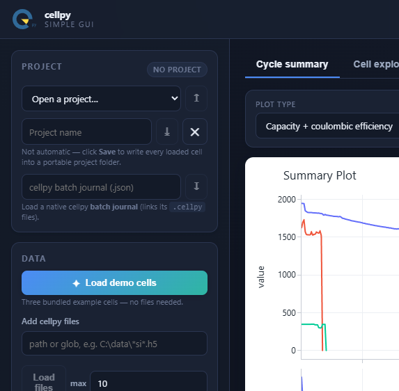
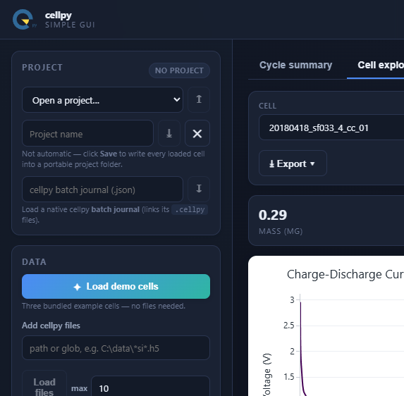
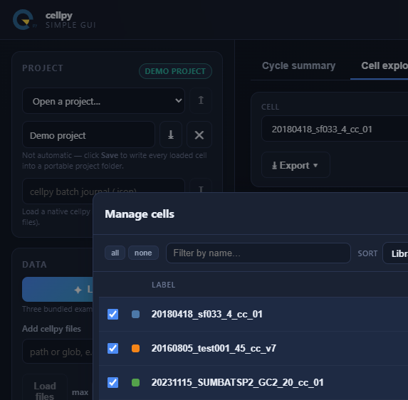
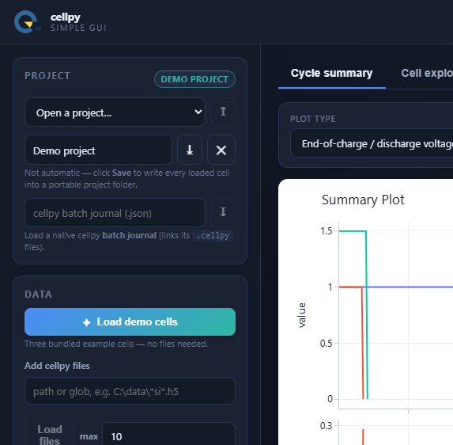

# cellpy simple gui

A small **desktop app** for exploring battery cell data with
[**cellpy**](https://github.com/jepegit/cellpy) (**≥ 2.1**).

It runs a local [FastAPI](https://fastapi.tiangolo.com/) backend inside a native
window (via [pywebview](https://pywebview.flowrl.com/)).



<p align="center">
  
  
</p>

---

## Features

- **Zero-setup demo** — one click loads three bundled example cells (no files needed).
- **Load your own** `.cellpy` / legacy `.h5` files.
- **Import raw instrument files** — Arbin `.res`, Maccor (text), Neware, PEC and more are
  processed into cellpy cells with a metadata step (mass / area / nominal capacity / cycle
  mode). One-click bundled raw demos too.
- **Save & reopen projects** — explicit Save (not autosave) writes the loaded set plus
  grouping / labels / selection into a portable project folder; reopen later. The project
  tag shows when you have unsaved edits (`name*`), and **Close** clears the current
  session after confirmation.
- **Cycle summary** across many cells — built with cellpy's own
  `collect_summaries` + plotting, with a **plot-type selector** (capacity + CE,
  capacity, coulombic efficiency, cumulated CE, end voltages, internal
  resistance, C-rate, capacity loss), a gravimetric / areal / absolute basis,
  optional group averaging with a mean ± std spread band, and independent or
  shared y-scales.
- **Cell explorer** — cellpy's `collect_cycles` voltage–capacity curves for any
  set of cycles (gravimetric / areal / absolute, method), with per-cell metric tiles.
- **Load data lots of ways**: bundled demo cells, `.cellpy` / `.h5` files,
  **native cellpy batch journals** (`.json`), or your own **project folders** —
  with **glob patterns** (`*si*.h5`, capped at a configurable max) and, in the
  desktop app, **native file pickers**. Journal load failures surface as toasts
  instead of a stuck spinner.
- **Editable cell list** (the "journal"): rename, group, select/deselect, remove —
  plus a **Manage cells** modal (filter/sort, select-by-group, remove all).
- **Instruments discovered from cellpy** at runtime (not hard-coded), with each
  loader's sub-models.
- **Clear feedback**: toast notifications for loads, saves, opens, exports, and
  errors (including corrupt journals).
- **Background loading** with live progress (SSE) — the UI never freezes.
- **Export** collected data to **CSV / Excel / Parquet / JSON**, and charts as
  **PNG / SVG / PDF** from **Export ▾** (server-side via kaleido — install with
  `uv sync --extra export`); the chart toolbar camera still saves a quick PNG.
- **Light & dark themes.**
- **Colorized terminal logging** via loguru (`CSG_LOG_LEVEL`, default `INFO`).

## Quick start

Requires **Python ≥ 3.13** and [uv](https://docs.astral.sh/uv/).

```bash
uv sync
```

Then from this folder:

```bash
run                 # Windows (cmd / PowerShell)
./run               # macOS / Linux / Git Bash
```

That opens the app in a native desktop window. Prefer your normal browser?

```bash
run --server              # local server + browser tab
run --server --no-open    # headless: just serve
```

The helpers use `uv run --extra export` so PNG/SVG/PDF figure export works.
Equivalent without them: `uv run --extra export cellpy-simple-gui` (same flags).
Then click **Load demo cells** and explore.

### Developer mode

```bash
run --dev                 # or set CSG_DEV_MODE=1
```

The regular UI shows a curated set of plot types, because cellpy registers far
more than are useful on any one dataset. Developer mode adds **every family
cellpy registers**, grouped by whether the loaded cells can actually plot them —
the rest are listed but disabled, showing which summary columns are missing
rather than rendering a blank chart. It also adds a **dV/dQ (differential
voltage)** view next to dQ/dV in the Cell explorer, and raises the glob/batch
file cap (10 → 500) for stress-testing. A **DEV** badge marks the session.

Off by default and not reachable from the UI: regular users get the curated set.

> First run downloads a few small example cells from the cellpy example-data
> repository (then cached). Everything else is fully offline.




## Projects on disk

A project is a portable folder — move it, zip it, share it:

```
<project>/
├── project.json      # manifest: name, timestamps, versions, per-cell grouping/labels/selection
├── cellpy.toml       # optional: cellpy settings pinned to this project
└── data/
    ├── c1.cellpy     # every loaded cell saved as a self-contained cellpy file
    └── c2.cellpy
```

Projects live under `~/.cellpy_simple_gui/projects/` by default; **Save** writes the
current set there and **Open** restores it (physical quantities come from the
`.cellpy` files, organisational metadata from the manifest). Changes in the UI
are **not** written until you Save.

### Per-project cellpy settings

Drop a `cellpy.toml` next to `project.json` and the app activates it as cellpy's
**project** configuration layer whenever that project is open — so the project
pins the settings its data was analysed with (cycle mode, units, defaults)
instead of being silently re-interpreted under whatever your global config says
today:

```toml
[reader]
cycle_mode = "cathode"

[units]
mass = "g"
```

A **cellpy.toml** chip appears next to the project name while those settings are
active; closing the project restores your own configuration. Settings never leak
from one project to the next. Click the chip (or the cellpy version badge) to see
every setting and which layer it came from — defaults, your user `cellpy.toml`,
the project file, or the environment.

Rather than writing the file by hand, open that panel with a project loaded and
hit **Pin settings to project**: it captures the `reader`, `units` and
`defaults` currently in effect. Only those sections are written — `paths` would
bake your machine's directory layout into a folder meant to be portable, and
leaving out `instruments`/`db` means the file structurally cannot contain a
credential.

The app never writes your user `cellpy.toml`; that file belongs to you and is
shared with your notebooks and the `cellpy` CLI.

## How it is built

Three layers, each testable on its own. The UI never imports cellpy; the core
never imports the web framework.

```
┌──────────────────────────────────────────────────────────────┐
│  desktop shell (pywebview window)                             │
│    └── web/  Alpine.js + Plotly.js  (served by the backend)   │
├──────────────────────────────────────────────────────────────┤
│  api/   FastAPI (127.0.0.1 + per-launch token)                │
│         routers · JobManager (threads + SSE progress)         │
├──────────────────────────────────────────────────────────────┤
│  core/  pure Python — no web imports                          │
│         models · library · plotting · export                  │
│         cellpy_adapter.py  ← the ONLY module that imports cellpy
└──────────────────────────────────────────────────────────────┘
                              │
                          cellpy ≥ 2.1
```

```
src/cellpy_simple_gui/
├── core/
│   ├── cellpy_adapter.py   # every cellpy call lives here (get, summary, get_cap, example_data)
│   ├── models.py           # Pydantic domain models (CellMeta, SummaryPlotSpec, …)
│   ├── library.py          # in-memory library of loaded cells = source of truth
│   ├── collect.py          # bridges the library into cellpy.collect / .plotting (from_cells)
│   ├── plotting.py         # thin: delegates figures to cellpy via collect.py
│   ├── projects.py         # save/open portable project folders (manifest + .cellpy files)
│   ├── files.py            # glob/path expansion with a max cap + messages
│   └── export.py           # csv / xlsx / parquet / json from cellpy collections
├── api/
│   ├── app.py              # FastAPI factory + index route
│   ├── jobs.py             # tiny thread-pool JobManager (progress + cancel)
│   └── routers/            # cells · plots · export · jobs · projects · ingest · system
├── web/                    # templates/ (Jinja) + static/ (css, js, vendored Plotly & Alpine)
├── logging_setup.py        # loguru terminal logging + stdlib bridge
├── server.py               # uvicorn-in-a-thread helper
├── desktop.py              # pywebview launcher
└── __main__.py             # entry point (desktop / --server)
```

**Powered by cellpy, not around it.** Summaries, grouping (incl. group averaging
with spread), per-cell cycle curves, the plots and the multi-format export are all
produced by cellpy's own `collect` / `plotting` subsystems. On **cellpy ≥ 2.1.1**
the app feeds them a real `Batch` via `cellpy.collect.from_cells(...)` built from
the in-memory library (`collect.py`), and discovers instruments via
`cellpy.list_instruments()`. The cellpy surface stays isolated to
`cellpy_adapter.py` + `collect.py`.


## Development

```bash
uv sync --extra dev
uv run pytest            # core unit tests + FastAPI integration tests
uv run pytest -m essential   # critical-path subset (also run in CI)
```

Optional Playwright GUI smoke tests (server/browser mode, not pywebview):

```bash
uv sync --extra dev --extra e2e
uv run playwright install chromium
uv run pytest -m e2e
```

Without the `e2e` extra / Chromium browsers, those tests skip so a plain
`uv run pytest` stays green.

GitHub Actions runs the `essential` marker on code changes; a matching
document-mock workflow keeps the same check name green on docs-only PRs.

Optional static figure export (**Export ▾ → Figure → PNG / SVG / PDF**, via kaleido):

```bash
uv sync --extra export
```

Without that extra, data export still works; figure formats show a toast pointing
at the install command above.

### Why we develop this app

The app is meant to inspire other users of cellpy to make their own apps. We
also use the development of this app to find pain-points in the cellpy library.

Already now, building this surfaced a number of cellpy rough edges, filed upstream as
[jepegit/cellpy#785–#791](https://github.com/jepegit/cellpy/issues/785) — **most were fixed in cellpy 2.1.1**. The full write-up and per-item status is in
[CELLPY_PAINPOINTS.md](CELLPY_PAINPOINTS.md).

## Status

This is an MVP / reference implementation

Done: load `.cellpy`/`.h5` files, **raw-file ingestion** (Arbin `.res` / Maccor / Neware /
PEC → cellpy), cycle-summary & cell-explorer plotting, editable cell list + Manage cells
modal, CSV/Excel/Parquet/JSON export with feedback, **save/open/close portable projects**,
batch-journal loading with error toasts, loguru console logging, and essential-test CI.

> Arbin `.res` loads on Windows through the Access ODBC driver (no separate mdbtools needed
> in this environment). Instruments needing extra engines will surface a clear error.

### Future plans

- packaging into a Windows installer (PyInstaller + InnoSetup, bundling WebView2).
- show-case more of the plots

## License

See [LICENSE](LICENSE).
